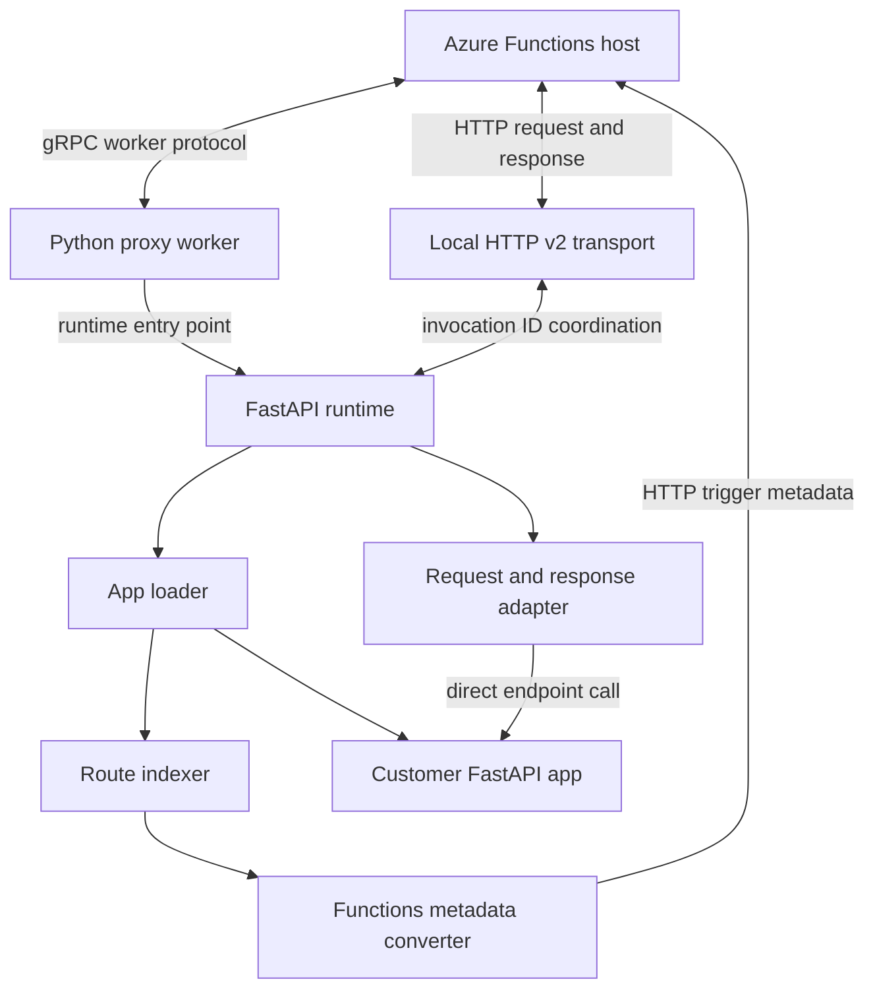

# Azure Functions FastAPI Runtime

The Azure Functions FastAPI runtime is a proposed native hosting path for
existing FastAPI applications. Customers add a runtime dependency to their
project, and Azure Functions discovers and runs the application without
requiring it to adopt the Azure Functions programming model.

> [!IMPORTANT]
> This package is an alpha prototype. This document distinguishes the intended
> customer experience from behavior implemented in the current prototype.

## Motivation

More than 4,000 Azure Functions applications already bring FastAPI as a
dependency, but Azure Functions does not currently provide a simple, native
hosting experience for FastAPI web applications.

Customers can use `func.AsgiFunctionApp` or `func.WsgiFunctionApp` today. Those
adapters require changes to the application entry point, move the application
into the Azure Functions programming model, and do not support streaming.
Custom handlers provide another option, but they require customers to own the
web-server setup and deployment contract, and their documentation and tooling
are limited.

The goal of this runtime is to remove that integration work. A conventional
FastAPI application should run on Azure Functions without source changes. The
customer adds one dependency, and the Functions platform handles runtime
selection, route discovery, function metadata, invocation, and HTTP transport.

## Customer Experience

### Application code

The application remains a standard FastAPI application. It does not import
`azure.functions`, create a `FunctionApp`, or wrap the FastAPI app in an
Azure Functions adapter.

```python
from fastapi import FastAPI

app = FastAPI()


@app.get("/hello")
async def hello():
        return {"message": "Hello from FastAPI on Azure Functions"}


@app.get("/users/{user_id}")
async def get_user(user_id: int):
        return {"user_id": user_id}
```

Place the app in either `function_app.py` or `app.py`. The module must expose
exactly one module-level `FastAPI` instance; the variable itself does not have
to be named `app`.

### Project dependency

The customer adds the FastAPI runtime package to `requirements.txt`:

```text
azure-functions-fastapi-runtime
```

`azure-functions-fastapi-runtime` is the proposed distribution name used in
this document. The prototype's `pyproject.toml` still uses a temporary package
name, so it is not yet ready for the described public installation flow.

No FastAPI-specific setting should be required in the target experience. The
runtime package registers itself through the `azurefunctions.runtimes` Python
entry-point group, allowing the proxy worker to select it automatically.

### Application discovery

The runtime checks for `function_app.py` first, then `app.py`. If both files
exist, `function_app.py` takes precedence. To use another filename, set:

```text
PYTHON_SCRIPT_FILE_NAME=app.py
```

### Modular applications

Use FastAPI's `APIRouter` and `include_router()` APIs to organize routes across
multiple files:

```text
function_app.py
app/
|-- schemas.py
`-- routers/
    |-- items.py
    |-- root.py
    `-- users.py
```

Each router module defines and exports an `APIRouter`:

```python
# app/routers/items.py
from fastapi import APIRouter

router = APIRouter()


@router.get("/")
async def list_items():
    return []
```

The entry point creates the FastAPI app and explicitly registers its routers:

```python
# function_app.py
from fastapi import FastAPI

from app.routers import items, root, users

app = FastAPI()
app.include_router(root.router)
app.include_router(items.router, prefix="/items")
app.include_router(users.router, prefix="/users")
```

FastAPI stores included and nested routers in the application's route registry.
The runtime indexes that registry directly, so it does not scan or import every
file under `app/routers`. Router registration must run while `function_app.py`
is imported; routers added later from startup or lifespan hooks are not
available when the Functions host requests metadata. A router module that is
not passed to `include_router()` is intentionally not indexed.

### API documentation

The runtime indexes FastAPI's configured documentation routes alongside the
application's API routes. With the default FastAPI configuration, these are:

- `/openapi.json` for the OpenAPI schema
- `/docs` for Swagger UI
- `/docs/oauth2-redirect` for the Swagger UI OAuth redirect
- `/redoc` for ReDoc

Custom `openapi_url`, `docs_url`, `swagger_ui_oauth2_redirect_url`, and
`redoc_url` values are respected, including disabling a route with `None`.
Generated documentation URLs include the route prefix used by Azure Functions.

## Implementation

### Architecture overview



The FastAPI package implements the runtime contract from
`azurefunctions-extensions-base`. The proxy worker discovers installed
runtimes from the `azurefunctions.runtimes` entry-point group and loads the
single registered runtime. The FastAPI package exports `Runtime`, which maps
worker protocol events to the implementation in `handle_event.py`.

### Startup and route discovery

During `WorkerInitRequest`, the runtime:

1. Reads the application directory supplied by the Functions host.
2. Selects the application filename from `PYTHON_SCRIPT_FILE_NAME`, or discovers
    `function_app.py` and then `app.py`.
3. Imports the module and finds its module-level `FastAPI` instance. Startup
     fails if none or more than one is present.
4. Iterates over the app's registered `APIRoute` entries and configured FastAPI
    documentation routes.
5. Creates one Functions metadata entry for every route, with an HTTP trigger
     and HTTP output binding.
6. Caches the app, route handlers, and generated metadata for invocation.

The endpoint callable name becomes the Azure Function name. For example,
`async def get_user(...)` is indexed as `get_user`, regardless of its route.
Changing the callable name therefore changes the generated function identity.

### Invocation

The Functions host uses the generated metadata to route a request to a function
ID. The runtime looks up the corresponding FastAPI endpoint and passes it to a
custom request/response adapter.

The current adapter does not execute the FastAPI application as a complete ASGI
application. It inspects the endpoint signature, supplies simple path and query
arguments, optionally supplies a request-like object, calls the endpoint
directly, and converts the result into an Azure Functions HTTP response. This
design proves route discovery and invocation, but it bypasses FastAPI processing
that normally occurs around the endpoint.

### HTTP v2 transport

HTTP v2 is enabled by default in the prototype. At worker initialization, the
runtime starts a local Uvicorn server with a Starlette catch-all route and
reports its URI to the Functions host. The host sends the HTTP request to this
local endpoint while sending the corresponding invocation over gRPC. An
in-process coordinator pairs the two paths using the invocation ID.

This is streaming transport between the host and worker. It does not currently
preserve a FastAPI `StreamingResponse` as an end-to-end streaming response: the
custom response adapter reads response bodies into the runtime's response
format. Server-sent events and other streaming-response scenarios must not yet
be considered supported.

## Current Support

The implementation and existing tests establish the following behavior:

| Area | Prototype status |
| --- | --- |
| Discover a module-level FastAPI app | Implemented |
| Index `APIRoute` routes | Implemented and unit tested |
| OpenAPI, Swagger UI, OAuth redirect, and ReDoc routes | Implemented and unit tested |
| Generate HTTP trigger and output metadata | Implemented and unit tested |
| GET, POST, PUT, DELETE, PATCH, HEAD, and OPTIONS metadata | Implemented |
| Async and sync endpoint calls | Implemented, without end-to-end coverage |
| Simple path and query parameters | Implemented, without end-to-end coverage |
| Basic JSON, text, and Starlette response formatting | Implemented, without end-to-end coverage |
| Full Pydantic request and response validation | Not implemented |
| FastAPI dependency injection | Not implemented |
| Middleware and lifespan events | Not implemented |
| FastAPI exception-handler semantics | Not implemented |
| Background tasks | Not implemented |
| WebSockets | Not supported by the current HTTP-trigger design |
| `StreamingResponse` and server-sent events | Not implemented end to end |

The sample application declares Pydantic models and several endpoint types, but
the current tests only validate route indexing and metadata conversion. They do
not constitute end-to-end coverage of request handling or FastAPI validation.

## Configuration and Constraints

- Python 3.10 or later is required.
- FastAPI 0.100.0 or later is required.
- Exactly one runtime package may be registered in the proxy worker process.
- The application module must contain exactly one module-level `FastAPI`
    instance.
- `PYTHON_SCRIPT_FILE_NAME` overrides automatic application-file discovery.
- A route's endpoint callable name is used as its generated Function name, so
    endpoint names must be unique.
- The package is classified as alpha and is not currently included in the
    repository's official build or release pipelines.

## Package Layout

| Component | Responsibility |
| --- | --- |
| `runtime.py` | Implements the runtime-base event contract |
| `handle_event.py` | Handles worker initialization, metadata, load, invocation, and reload events |
| `loader.py` | Imports the customer module and builds Functions metadata |
| `indexer.py` | Discovers FastAPI routes and endpoint callables |
| `converter.py` | Converts routes into HTTP trigger and output bindings |
| `handler.py` | Adapts requests, calls endpoints, and formats responses |
| `http_v2.py` | Runs and coordinates the local HTTP v2 transport |

## Development

Install the package and development dependencies from this directory:

```bash
python -m pip install -e ".[dev]"
python -m pytest tests -v
```

The package is a prototype rather than a supported Azure Functions feature.
Production readiness requires running FastAPI through the appropriate ASGI
lifecycle, adding end-to-end host coverage, settling the distribution identity,
and integrating the package into the official build and release process.
